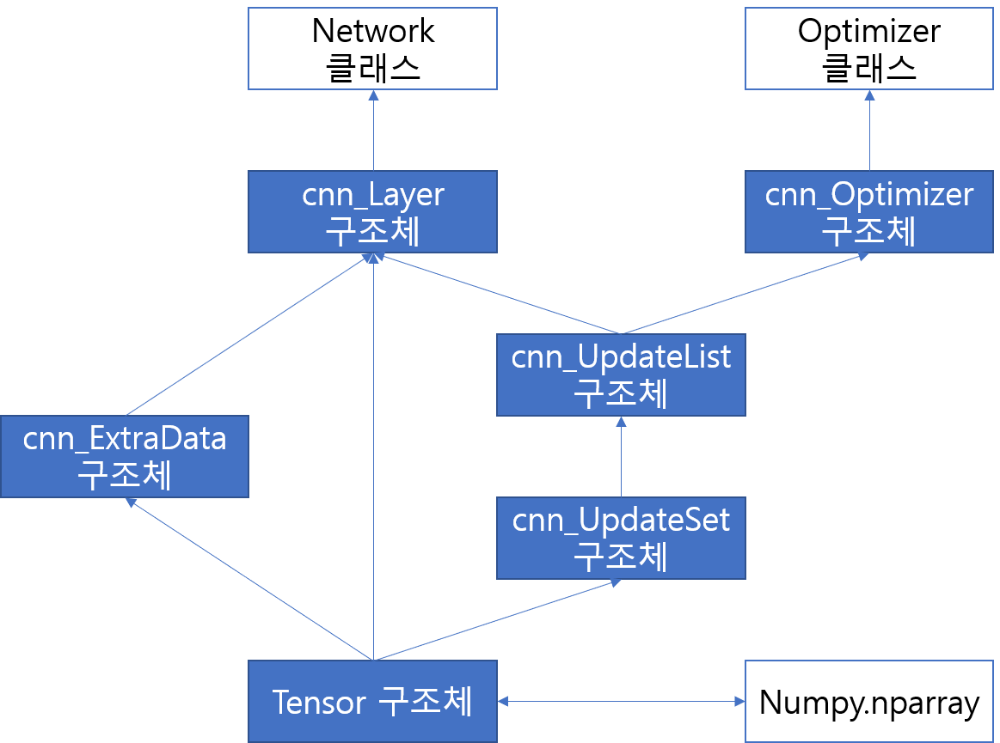

cnn
=========
나만의 신경망 (with c)

>참고!! master, test 분기에서 deconv는 미완성 버전입니다. 메모리 오버플로우 현상이 있으므로, deconv를 사용하면 안됩니다.

# index
1. [설명](#1설명)

    1.1. [순수 파이썬 vs Ctypes](#11순수_파이썬_vs_Ctypes)

    1.2. [구조](#12구조)

2. [설치](#2설치)

# [1.](#index)설명
c로 만들어진 신경망 패키지입니다. 이전 작품인 [NN](https://github.com/hslee1539/nn)(순수 파이썬 코딩)의 느린 속도를 보안하기 위해 만들었습니다.

C로도 작업이 가능하고, python으로도 사용 가능합니다.

## [1.1.](#1설명)순수 파이썬 vs Ctypes
이 패키지의 test.py를 통해 c->so->python vs only python의 성능을 간단히 테스트 할 수 있습니다.
완전 같은 알고리즘으로 테스트를 했으며,
i5-7300u 기준으로, forward는 50억배, backward는 189배 빠른 결과를 얻었습니다.

## [1.2.](#설명)구조

파란색 박스는 c언어로 된 구조체와 각각의 구조체에서 필요한 연산을 수행하는 함수들을 요약한 것을 의미합니다.
그리고 흰색 박스는 python 파이썬의 클래스 위주로 요약한 것을 의미합니다.

# [2.](#index)설치

[download cnn-master.zip](https://github.com/hslee1539/cnn/archive/master.zip)

작업 폴더 안에 위 압축파일에서 cnn폴더 전체와 tensor 폴더 전체가 올 수 있게 합니다.